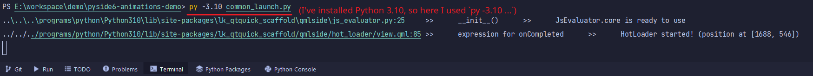

# Preparation

- Python 3.8 and above
- `pip install lk-qtquick-scaffold>=1.1.0`

# Quick Start

Open 'common_launch.py' and edit your target file.

Then run command like this:

```
py -3.8 common_launch.py
```

Screenshot:


